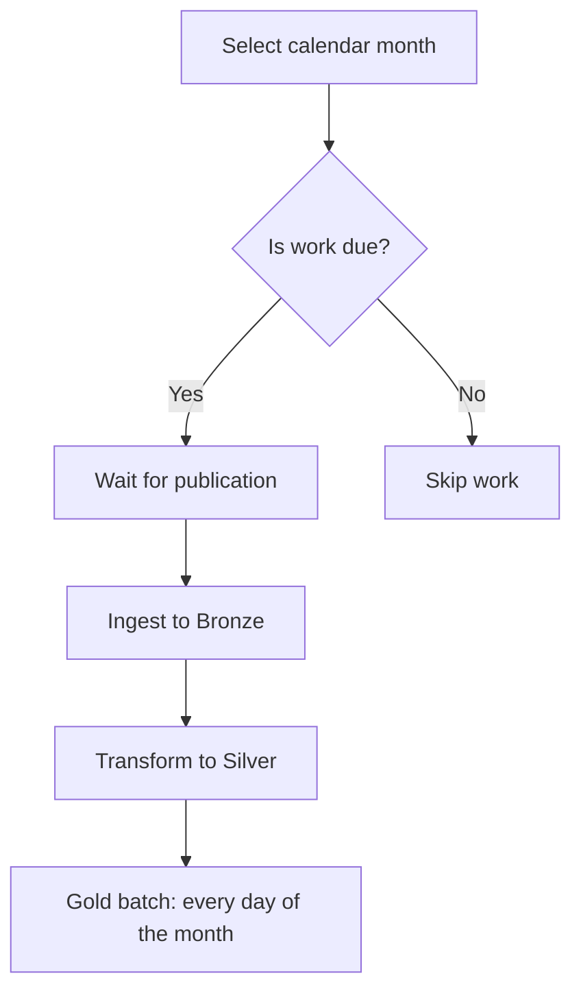

# 🚲 Meridian Bike Pipeline


> From independently runnable jobs to an automated monthly pipeline:
> schedules, publication waits, retries, backfills and warehouse coverage.

A data engineering project built with Python, PostgreSQL 17,
Docker Compose, Just and Apache Airflow 3.1.0.

The pipeline loads Citi Bike trip data into Bronze, normalizes historical
and modern schemas in Silver, and produces daily station metrics in Gold.

Stage 2 adds scheduling, publication waits, retries, backfills and coverage
tracking around the unchanged Stage 1 jobs.

---

## 🎯 Project Status

| Milestone | Verified result |
| --- | --- |
| 📦 Historical catchup | 68 complete months through August 2026 in **3m 43s** |
| 🔄 Automatic recovery | Silver container and Gold day retries passed |
| 📊 Coverage | Watermark, gaps and next-month selection passed |
| 🔒 Stage 1 compatibility | Unchanged jobs and byte-identical June report |

Stages 1 and 2 are implemented. Validation results and their scope are
documented in [Stage 2 checkpoints](docs/stage2/).

This is a local development stack. It uses development credentials and
mounts the Docker socket so Airflow can launch the existing Silver job.

---

## 📋 Requirements

- Docker with Docker Compose
- Just
- Bash
- Internet access for image builds and source downloads
- Python 3 for the host-side validation scripts

Run commands from the repository root.

---

## 🚀 Quick Start

```bash
docker compose build
just up
```

`just up` initializes the operational tables, starts Airflow and the
warehouse, and switches every market schedule off on each invocation.

The Airflow UI is available at http://localhost:8080.
The Simple Auth Manager generates the admin password in
`/opt/airflow/logs/simple_auth_passwords.json` inside the Airflow containers.

```bash
just down
```

Stopping the stack preserves its named data volumes.

---

## 🥉 Stage 1 — Independent Jobs

```bash
just run ingest-to-bronze trips:jc 2026-06
just run transform-to-silver trips:jc 2026-06
just run transform-to-gold station-daily 2026-06-02

just inspect bronze trips:jc 2026-06
just inspect silver trips:jc 2026-06
just report daily-station-trips jc JC115 2026-06-02
```

Expected report:

```json
{"market":"jc","station":"JC115","day":"2026-06-02","departures":216,"arrivals":209}
```

These commands remain usable with Airflow stopped. Manual job executions
do not write operational load records.

Trip jobs require a monthly window (`YYYY-MM`). The Gold job requires
a daily window (`YYYY-MM-DD`).

---

## ⚙️ Stage 2 — Operational Commands

```bash
just schedule jc on
just schedule jc off

just run pipeline jc
just run pipeline jc 2026-06
just run pipeline jc 2021-01 2021-02

just inspect coverage trips:jc
just inspect runs jc
```

| Command | Behavior |
| --- | --- |
| `schedule <market> on` | Enables monthly scheduling and historical catchup |
| `schedule <market> off` | Disables future automatic scheduling after DAG refresh |
| `run pipeline <market>` | Processes the earliest incomplete month if published |
| `run pipeline <market> <month>` | Processes that month, including a complete month |
| `run pipeline <market> <first> <last>` | Processes the inclusive range through Airflow backfill |
| `inspect coverage <job>` | Computes coverage from operational load records |
| `inspect runs <market>` | Reports Airflow runs, newest queued first |

Pipeline commands block until their runs finish and return a non-zero
exit code if any run fails.

When the next incomplete month is unpublished, a windowless request
succeeds with `month: null` and `work: skipped`. A named unpublished
month waits for publication and fails after the sensor timeout.

Disabling scheduling does not cancel runs already queued or running.
Schedule changes take effect when Airflow reparses the touched DAG file.

---

## 🌍 Markets and Historical Windows

Committed configuration lives in `src/config.py`.

| Market | Job | Earliest operational month |
| --- | --- | --- |
| Jersey City | `trips:jc` | `2021-01` |
| NYC | `trips:nyc` | `2026-01` |

Stage 1 manual jobs can still process older historical windows.

---

## 🏗️ Airflow Architecture

Each market has its own DAG: `pipeline_jc` and `pipeline_nyc`.



| Job task | Execution |
| --- | --- |
| Bronze | Imports and calls the Stage 1 ingestion job in process |
| Silver | Runs `just run transform-to-silver` in a subprocess |
| Gold | Calls the Stage 1 day job in a single monthly batch |

The DAG file wires calls together. Processing loops, load recording,
locking and coverage logic live in the Python package.

- Calendar-month intervals use a custom monthly interval timetable.
- Publication checks reschedule every five minutes, releasing the worker.
- The publication timeout is seven days.
- Job tasks allow two retries with a 30-second delay.
- Each DAG allows up to 16 active runs and 32 active tasks.
- PostgreSQL advisory locks coordinate concurrent month jobs and Gold days.
- A scheduled run skips its work when its month is already complete.

The Silver subprocess uses Just, Docker Compose and the Docker socket.
It uses the same Compose project and warehouse as the parent Airflow stack.

---

## 📊 Load Recording and Coverage

Operational wrappers record a load only after the corresponding job
succeeds. The control table stores the latest successful timestamp for
each job, market and window.

A month is complete when:
1. Its Silver load is recorded.
2. Every Gold day is recorded after that Silver load.

A successful Silver rerun therefore makes old Gold records insufficient
until the Gold days have been rebuilt.

Coverage is computed when requested:
- `watermark`: the last contiguous complete month from the earliest window.
- `complete`: the number of complete months from the earliest window onward.
- `gaps`: incomplete months through the newest complete month.
- `next`: the earliest incomplete month.

Example after January, February and April are complete:

```json
{"job":"trips:jc","earliest":"2021-01","watermark":"2021-02","complete":3,"gaps":["2021-03"],"next":"2021-03"}
```

Gold continues processing other days after a day fails, records successful
days, then raises an error naming failed days. Its retry skips days already
recorded after the current Silver load.

Gold replacement uses the existing Stage 1 transaction, preserving complete
committed answers while a day is rebuilt.

---

## ✅ Verified Results

### Stage 1 data

| Dataset | Bronze rows | Silver rows | Rejects |
| --- | ---: | ---: | ---: |
| JC 2019-06 | 39,430 | 39,430 | 0 |
| JC 2026-06 | 109,897 | 109,510 | 387 |
| NYC 2018-04 | 1,307,543 | 1,307,543 | 0 |

### Stage 2 acceptance checks

- Stage 1 job files remained unchanged.
- Manual June jobs and inspections worked with Airflow stopped.
- Manual and pipeline June reports were byte-identical.
- January and February backfills succeeded with 31 and 28 Gold days.
- A pre-history request failed on its first attempt with no load records.
- Killing a Silver container caused an automatic retry and eventual success.
- A Gold day failure left 29 successful days recorded; automatic retry
  completed only the missing day.
- Concurrent reads preserved the baseline Gold answers during rebuild.
- Two simultaneous runs for the same month preserved data and coverage.
- An interrupted named rerun became incomplete and was selected for recovery.
- A complete scheduled month skipped its job tasks without changing records.
- An unpublished windowless request succeeded without work.
- A named unpublished month rescheduled, then failed with
  `AirflowSensorTimeout` when elapsed time was simulated beyond seven days.
- A fully hand-loaded January left coverage empty; the pipeline still selected it.
- The January/February/April gap scenario selected March, then May.

On a fresh isolated stack, scheduled JC history reached all 68 months
through August 2026 with no gaps in **223.44 seconds**.

September was also published at validation time on October 7, 2026:
all 69 months through September finished in **233.89 seconds**, using
69 successful scheduled runs.

Detailed evidence and test limitations are recorded in
[the checkpoint documents](docs/stage2/). No pre-existing automated Stage 1
test suite was found; its documented data and command checks were exercised.

---

## 🧪 Validation Scripts

Scripts in `scripts/` exercise Silver retry, Gold retry, concurrent runs,
interrupted reruns and fresh scheduled history.

Several scripts deliberately kill a container, stop a scheduler or install
temporary database failure triggers. Read their checkpoint documents and
stack settings before running them.

The scheduled-history script requires its configured test stack to have
no prior loads or runs.

---

## 🐳 Isolated Test Stacks

Compose project names and API ports can be overridden:

```bash
COMPOSE_PROJECT_NAME=meridian-demo AIRFLOW_PORT=8083 docker compose build
COMPOSE_PROJECT_NAME=meridian-demo AIRFLOW_PORT=8083 just up
COMPOSE_PROJECT_NAME=meridian-demo AIRFLOW_PORT=8083 just inspect coverage trips:jc
```

Use the same environment settings for every command on that stack.
Each project has separate warehouse and Airflow log volumes.

---

## 📁 Project Structure

| Path | Responsibility |
| --- | --- |
| `src/ingest.py` | Stage 1 source discovery and Bronze ingestion |
| `src/silver.py` | Stage 1 schema normalization and reject quarantine |
| `src/gold.py` | Stage 1 daily aggregation and report |
| `src/cli.py`, `src/inspect.py` | Stage 1 command contracts |
| `src/config.py` | Earliest operational windows |
| `src/operations.py` | Load recording, Gold batch and computed coverage |
| `src/pipeline.py` | Job wrappers, month selection and locks |
| `src/schedules.py`, `src/timetable.py` | Schedule settings and monthly intervals |
| `src/operational_cli.py` | Blocking pipeline controller |
| `src/operational_inspect.py` | Coverage and Airflow run inspection |
| `airflow/dags/pipelines.py` | Market DAG wiring |
| `airflow/plugins/meridian_plugin.py` | Custom timetable registration |
| `sql/operations.sql` | Repeatable operational schema initialization |
| `docs/stage2/` | Incremental implementation and validation checkpoints |

---

## 🔧 Airflow Version Compatibility

The backfill controller uses Airflow's internal `_create_backfill` function
in an isolated Python subprocess to pass a decoded configuration dictionary.
Airflow 3.1.0's CLI stored that supplied configuration as a JSON string in
the observed environment.

This integration and the metadata inspection queries must be reviewed
before upgrading the pinned Airflow version.
