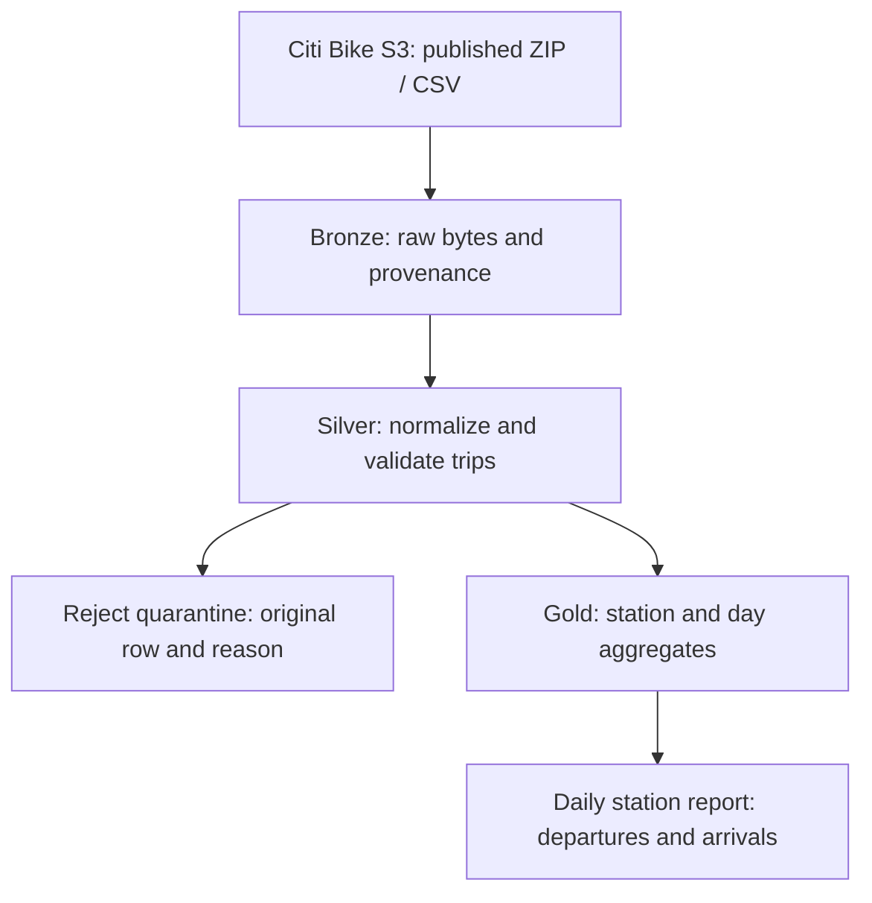
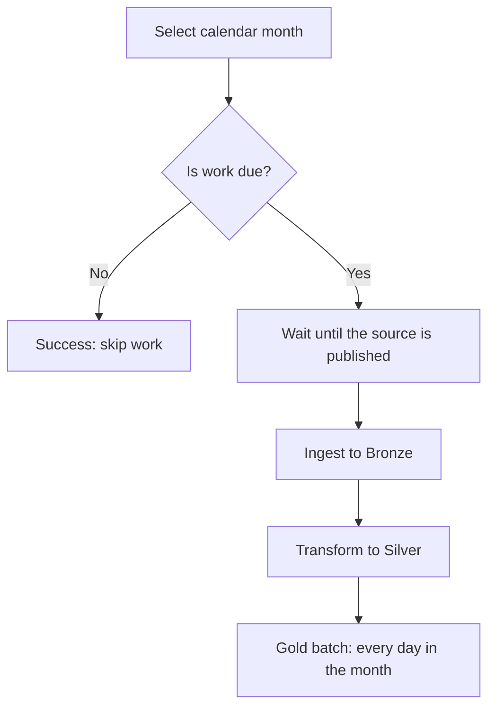

# 🚲 Meridian Bike Pipeline


> A data engineering pipeline that turns historical Citi Bike exports into
> daily station metrics — then keeps the warehouse updated with scheduling,
> publication waits, retries and coverage tracking.

Built with **Python, PostgreSQL, Docker Compose, Just and Apache Airflow**.

---

## 🎯 Project Overview

Citi Bike publishes trip data for NYC and Jersey City, but turning those
exports into a dependable warehouse requires more than downloading CSV files.

Historical datasets use different schemas. Publishing conventions change.
Some archives contain multiple exports of the same month. Trips can have
missing station information, and monthly files arrive without a fixed
publication date.

The project addresses these challenges in two stages:

| Stage | Question it answers | What it delivers |
| --- | --- | --- |
| **Stage 1 — The Shape of the Job** | How do we turn published trips into correct station metrics? | Independently runnable Bronze, Silver and Gold jobs |
| **Stage 2 — Survive the Night** | How do we keep those jobs running without someone watching? | Airflow scheduling, waits, retries, backfills and progress tracking |

**Stage 2 wraps the existing jobs. The Stage 1 job implementations remain unchanged.**

### Highlights

| Result | Verified outcome |
| --- | --- |
| 📦 Historical catchup | 68 JC months through August 2026 in **223.44 seconds** |
| 🔄 Failure recovery | Automatic retries after a killed Silver container and a failed Gold day |
| 📊 Progress tracking | Correct watermark, gaps and earliest incomplete month |
| 🔒 Compatibility | Manual and pipeline reports were **byte-identical** |
| 🚦 Concurrent execution | Two simultaneous runs preserved monthly data and coverage |

### Contents

- [Stage 1 — The Shape of the Job](#stage-1--the-shape-of-the-job)
- [Stage 2 — Survive the Night](#stage-2--survive-the-night)
- [Quick Start](#quick-start)
- [Technology and Project Structure](#technology-and-project-structure)
- [Validation and Implementation Notes](#validation-and-implementation-notes)

---

<a id="stage-1--the-shape-of-the-job"></a>

# 🥉 STAGE 1 — The Shape of the Job

**Purpose:** build the complete data path from published source files to
a reproducible daily station report.

Each job has an explicit input window and can be run independently.
This makes the processing logic usable both by hand and through the
operational layer added in Stage 2.


### What this stage contains

| Part | Contents |
| --- | --- |
| **1.1 — Architecture** | Source data, Bronze, Silver, Gold and reject quarantine |
| **1.2 — Engineering challenges** | Schema evolution, archive selection, data quality, rebuilds and processing grains |
| **1.3 — Commands** | Running and inspecting the independent jobs by hand |
| **1.4 — Results** | Historical row counts, rejects and the station report |

## 1.1 — 🏗️ Data Architecture



| Layer | Responsibility | Rebuild source |
| --- | --- | --- |
| **Bronze** | Preserve published CSV bytes, source identity and row counts | Published source archive |
| **Silver** | Conform historical and modern schemas; separate countable trips from rejects | Bronze |
| **Gold** | Aggregate departures and arrivals by market, station and day | Silver |

Bronze keeps the source material available for subsequent transformations.
Silver and Gold can be rebuilt from stored upstream data without downloading
the source again.

## 1.2 — 🧠 Engineering Challenges

### 1. Schema evolution

Older Citi Bike datasets use fields such as:

`start station id`, `end station id`, `starttime`, `stoptime`

Modern datasets use:

`start_station_id`, `end_station_id`, `started_at`, `ended_at`

Silver maps both field naming conventions into the same trip model.
The mapping follows the columns present in the file rather than relying
on one global schema cutover date.

This allows historical and modern months to pass through the same job.

### 2. Multiple publishing conventions

Jersey City and NYC use different object naming patterns.
Some NYC historical data is published in annual archives, while other
datasets are published by month.

The ingestion job discovers matching source objects and selects the
most recently modified matching object. It then selects the relevant
CSV members inside the archive.

For **NYC April 2018**, the annual archive contains multiple April exports.
The ingestion logic explicitly prefers the export under `4_April/`,
producing **1,307,543 rows**.

This handles the publishing layout directly instead of hiding duplicate
exports through raw-row deduplication.

### 3. Data quality without silently losing rows

A countable trip requires:

- Start station identifier
- End station identifier
- Start timestamp
- End timestamp

Rows missing those required values are stored in `silver_rejects`
with the original row and a rejection reason.

For **JC June 2026**, the result was:

| Classification | Rows |
| --- | ---: |
| Published Bronze rows | 109,897 |
| Countable Silver trips | 109,510 |
| Quarantined rows | 387 |

The rejected rows remain available for inspection rather than disappearing
from the processing history.

### 4. Reproducible rebuilds

Silver rebuilds a market's monthly window from Bronze.
Gold rebuilds a day's station aggregates from Silver.

The replacements use database transactions, and repeated successful runs
do not accumulate duplicate records.

For Gold, the deletion and replacement happen within one transaction.
Readers continue to see committed data while the replacement is being built.

### 5. Explicit processing grains

| Job | Window |
| --- | --- |
| `ingest-to-bronze` | Month: `YYYY-MM` |
| `transform-to-silver` | Month: `YYYY-MM` |
| `transform-to-gold` | Day: `YYYY-MM-DD` |

Incorrect grains are rejected with a non-zero exit code.

## 1.3 — 💻 Manual Job Commands

```bash
# Download and preserve a monthly source
just run ingest-to-bronze trips:jc 2026-06

# Build countable trips and quarantine rejected rows
just run transform-to-silver trips:jc 2026-06

# Build one day's station metrics
just run transform-to-gold station-daily 2026-06-02

# Inspect stored data
just inspect bronze trips:jc 2026-06
just inspect silver trips:jc 2026-06

# Query the business result
just report daily-station-trips jc JC115 2026-06-02
```

**These commands work with Airflow stopped.**
Running them by hand does not create Stage 2 operational load records.

## 1.4 — ✅ Verified Data and Reports

| Dataset | Bronze Rows | Silver Rows | Rejects |
| --- | ---: | ---: | ---: |
| JC — 2019-06 | 39,430 | 39,430 | 0 |
| JC — 2026-06 | 109,897 | 109,510 | 387 |
| NYC — 2018-04 | 1,307,543 | 1,307,543 | 0 |

For Jersey City station **JC115** on **2026-06-02**:

```json
{
  "market": "jc",
  "station": "JC115",
  "day": "2026-06-02",
  "departures": 216,
  "arrivals": 209
}
```

During Stage 2 validation:
- The Stage 1 job files were compared with their earlier Git version and were unchanged.
- June jobs, inspections and the report worked with Airflow stopped.
- Historical datasets matched the documented counts.
- Incorrect processing grains failed with exit code `2`.
- The manual report and the report after a pipeline run were byte-identical.

---

<a id="stage-2--survive-the-night"></a>

# ⚙️ STAGE 2 — Survive the Night

**Purpose:** keep the warehouse moving without requiring someone to
run each command, discover new source files or recover failed work manually.

The vendor publishes a month's data a few days into the next month,
without a fixed publication date. Operations also needs the historical
backlog loaded and a clear answer to: **how far has the warehouse got?**

Stage 2 provides that operational layer around the Stage 1 jobs.


### What this stage contains

| Part | Contents |
| --- | --- |
| **2.1 — Markets** | DAG per market and committed earliest windows |
| **2.2 — DAG execution** | Control tasks, job tasks and execution methods |
| **2.3 — Scheduling** | Monthly intervals, catchup, publication sensor and timeout |
| **2.4 — Recovery** | Retries, failed Gold days and concurrent execution |
| **2.5 — Progress** | Successful load records, completion, watermark, gaps and next month |
| **2.6 — Commands** | Scheduling, blocking pipeline runs, backfills and inspection |
| **2.7 — Docker bridge** | Launching the unchanged Silver job from Airflow |
| **2.8 — Acceptance tests** | Verified behavior under normal operation and failures |
| **2.9 — Performance** | Fresh-stack historical loading and measured timings |

## 2.1 — 🌍 Markets and Historical Windows

| Market | DAG | Earliest Operational Month |
| --- | --- | --- |
| Jersey City | `pipeline_jc` | `2021-01` |
| NYC | `pipeline_nyc` | `2026-01` |

Earliest windows are committed in `src/config.py`.

Each run processes **one calendar month of one market**.
Stage 1 manual jobs can still process older historical windows.

## 2.2 — 🏗️ DAG Structure and Job Execution



The DAG has six tasks: three control tasks and three job tasks.

| Job Task | Execution | Operational Recording |
| --- | --- | --- |
| Bronze | Import and call the existing ingestion job in process | Record after successful ingestion |
| Silver | Subprocess running `just run transform-to-silver` | Record after the subprocess succeeds |
| Gold | One monthly task calling the existing day job for every day | Record each successful day |

The DAG file wires calls together.
Month selection, recording, locking, progress calculations and the Gold
day loop live in the Python package.

## 2.3 — ⏰ Scheduling and Publication Waits

A custom `CronDataIntervalTimetable` uses the monthly expression
`0 0 1 * *` in UTC.

Its data intervals identify complete calendar months. Historical catchup
creates scheduled runs starting at each market's earliest month.

Publication checks use a **reschedule-mode sensor**:
- Check every five minutes.
- Release the worker between checks.
- Fail the run after a seven-day timeout.

A scheduled run for a month already complete skips its job tasks.
A named manual rerun processes the requested month again.

`just up` switches every market schedule off on each invocation.
Schedule changes take effect after Airflow reparses the DAG.

## 2.4 — 🔄 Retries, Recovery and Concurrency

Job tasks allow **two retries**, with a **30-second delay**.

Each market DAG permits up to **16 active runs** and **32 active tasks**,
allowing independent months to progress concurrently.

PostgreSQL advisory locks coordinate work for the same market and month.
Gold also uses a lock shared by operations rebuilding the same day,
because the Stage 1 day job aggregates all markets.

When one Gold day fails, the monthly batch:
1. Continues attempting the remaining days.
2. Records the days that succeed.
3. Fails with an error naming the failed days.
4. On retry, skips days already complete after the latest Silver load.

This avoids repeating successful days during a Gold retry.

## 2.5 — 📚 Load Recording and Coverage

The operational layer writes `operational_loads` only **after a job succeeds**.

The table keeps the latest successful timestamp for each job, market and
window. Repeated recordings update the existing key rather than creating
duplicate rows.

A month is complete when:
- Its Silver load is recorded.
- Every day has a Gold record newer than that Silver load.

A successful Silver rerun therefore makes old Gold records insufficient.
If the run stops before Gold finishes, that month becomes incomplete again.

Coverage is computed from these records whenever requested:

| Field | Meaning |
| --- | --- |
| `earliest` | The configured start of operational history |
| `watermark` | Last month in the unbroken sequence of complete months |
| `complete` | Number of complete months from the earliest window onward |
| `gaps` | Incomplete months through the newest complete month |
| `next` | Earliest incomplete month from the start of history |

After January, February and April are complete:

```json
{
  "job": "trips:jc",
  "earliest": "2021-01",
  "watermark": "2021-02",
  "complete": 3,
  "gaps": ["2021-03"],
  "next": "2021-03"
}
```

The next windowless request processes March.
The following request processes May, because April is already complete.

## 2.6 — 💻 Operational Commands

```bash
# Enable or disable automatic scheduling
just schedule jc on
just schedule jc off

# Process the earliest incomplete month, if published
just run pipeline jc

# Process a specific month, including a complete month
just run pipeline jc 2026-06

# Process an inclusive month range as an Airflow backfill
just run pipeline jc 2021-01 2021-02

# Inspect dynamically computed coverage
just inspect coverage trips:jc

# Inspect Airflow runs, newest queued first
just inspect runs jc
```

Pipeline commands **block until their runs finish** and return a non-zero
exit code if any run fails.

When the next incomplete month is unpublished:
- A windowless request succeeds with `month: null` and `work: skipped`.
- A named request waits for publication and is subject to the sensor timeout.

Turning a schedule off prevents future automatic scheduling after refresh.
It does not cancel work already queued or running.

Run inspection uses Airflow's own types, states and stored attempt counts.
Reprocessing an existing run can increase its cumulative attempt counts.

## 2.7 — 🐳 Docker and Silver Subprocess Bridge

Airflow includes Just and the Docker CLI, mounts the repository, and has
access to the Docker socket.

The Silver wrapper launches the existing Stage 1 command through Docker
Compose using the same project name and warehouse.

This keeps the Silver processing in a separate application container while
preserving the existing job interface.

## 2.8 — ✅ Acceptance and Failure Tests

| Scenario | Observed Result |
| --- | --- |
| January–February 2021 backfill | Successful `backfill` runs; 31 and 28 Gold days |
| Request before earliest window | First-attempt failure; downstream `upstream_failed`; no load records |
| Silver container killed mid-work | Automatic retry; final success with two attempts |
| One Gold day fails | Other 29 days recorded; automatic retry completes only the missing day |
| Reads during Gold rebuild | Complete committed answers matched the baseline |
| Same month fired twice concurrently | Both runs succeeded; data and coverage unchanged |
| Named rerun interrupted after Silver | Month became incomplete and was selected for recovery |
| Complete scheduled month reprocessed | Work skipped; operational records unchanged |
| No published month due | Success with `month: null` and skipped work |
| Named unpublished month | Rescheduled, then failed through `AirflowSensorTimeout` |
| Entire January loaded by hand | Coverage remained empty; pipeline still selected January |
| January, February and April complete | Gap was March; windowless requests selected March, then May |

## 2.9 — 🚀 Historical Catchup Performance

Enabling JC scheduling on a fresh isolated stack loaded:

| Checkpoint | Complete Months | Watermark | Gaps | Elapsed |
| --- | ---: | --- | --- | ---: |
| Required history | 68 | `2026-08` | None | **223.44 seconds** |
| All months published at validation time | 69 | `2026-09` | None | **233.89 seconds** |

The required history finished in approximately **3 minutes 43 seconds**,
within the 30-minute requirement.

September was also available when validation ran on October 7, 2026.
All 69 runs were **scheduled**, all succeeded, and none were manual or backfill.

Detailed evidence is recorded in [Stage 2 checkpoints](docs/stage2/).

---

<a id="quick-start"></a>

## 🚀 Quick Start

### Prerequisites

- Docker with Docker Compose
- Just
- Bash
- Internet access for image builds and source downloads
- Python 3 for host-side validation scripts

Run commands from the repository root.

### 1. Build and start

```bash
docker compose build
just up
```

This starts PostgreSQL and Airflow, initializes the operational tables,
and leaves every schedule **off**.

The Airflow UI is available at **http://localhost:8080**.
Simple Auth Manager generates the admin password in
`/opt/airflow/logs/simple_auth_passwords.json` inside the Airflow containers.

### 2. Run a month through Airflow

```bash
just run pipeline jc 2026-06
```

### 3. Inspect progress and query the result

```bash
just inspect coverage trips:jc
just inspect runs jc
just report daily-station-trips jc JC115 2026-06-02
```

### 4. Enable automatic loading when wanted

```bash
just schedule jc on
```

### 5. Stop the stack

```bash
just down
```

Named data volumes are preserved.

### Isolated Test Stacks

Project names and API ports can be overridden:

```bash
COMPOSE_PROJECT_NAME=meridian-demo AIRFLOW_PORT=8083 docker compose build
COMPOSE_PROJECT_NAME=meridian-demo AIRFLOW_PORT=8083 just up
COMPOSE_PROJECT_NAME=meridian-demo AIRFLOW_PORT=8083 just inspect coverage trips:jc
```

Use the same environment settings for every command on that stack.
Each Compose project has separate warehouse and Airflow log volumes.

---

<a id="technology-and-project-structure"></a>

## 🛠️ Technology and Project Structure

### Technology

| Technology | Responsibility |
| --- | --- |
| **Python 3.13** | Data processing, command interfaces and operational logic |
| **PostgreSQL 17** | Bronze, Silver, rejects, Gold, operational records and Airflow metadata |
| **Apache Airflow 3.1.0** | Scheduling, task execution, retries and backfills |
| **Docker** | Reproducible application and Airflow runtime |
| **Docker Compose** | Service orchestration and isolated project stacks |
| **Just** | Manual and operational command interface |
| **Citi Bike S3** | Published trip archives |

### Stage 1 Components

| Path | Responsibility |
| --- | --- |
| `src/ingest.py` | Source discovery and Bronze ingestion |
| `src/silver.py` | Schema mapping, countable trips and reject quarantine |
| `src/gold.py` | Daily station aggregation and report |
| `src/inspect.py` | Bronze and Silver inspection |
| `src/cli.py` | Stage 1 argument validation and job routing |
| `src/db.py` | Warehouse connection |
| `sql/init.sql` | Initial storage schema |

### Stage 2 Components

| Path | Responsibility |
| --- | --- |
| `src/config.py` | Earliest operational windows |
| `src/operations.py` | Load recording, Gold batch and computed coverage |
| `src/pipeline.py` | Month selection, source checks, job wrappers and locks |
| `src/schedules.py` | Stored schedule settings |
| `src/timetable.py` | Monthly data intervals and scheduling control |
| `src/operational_cli.py` | Blocking manual pipeline and backfill controller |
| `src/operational_inspect.py` | Coverage and Airflow run inspection |
| `airflow/dags/pipelines.py` | Market DAG wiring |
| `airflow/plugins/meridian_plugin.py` | Custom timetable registration |
| `sql/operations.sql` | Repeatable operational schema initialization |
| `scripts/` | Failure injection and integration validation |
| `docs/stage2/` | Implementation and validation checkpoints |

Shared runtime configuration lives in `Dockerfile`, `compose.yaml`,
`requirements.txt` and `justfile`.

---

<a id="validation-and-implementation-notes"></a>

## 🧪 Validation and Implementation Notes

### Evidence and Scope

The checkpoint documents record the commands, observed results and
limitations of each validation step.

- No pre-existing automated Stage 1 test suite was found.
  Its documented counts, reports and command behavior were exercised.
- The sensor timeout was tested by simulating elapsed time beyond seven days
  in the isolated test run's reschedule record.
- Schedule-off validation checked the stored flag and timetable behavior.
  It did not test cancellation of existing runs.
- The fresh-stack performance result is an observed local measurement.

Some scripts deliberately kill a container, stop a scheduler or install
temporary database triggers. Read their checkpoint documents and stack
settings before running them.

The scheduled-history script requires its configured stack to have
no prior loads or runs.

### Airflow Version Compatibility

The backfill controller invokes Airflow's internal `_create_backfill`
function in an isolated Python subprocess, passing a decoded dictionary.

This addressed the observed Airflow 3.1.0 CLI behavior of storing the
supplied backfill configuration as a JSON string.

Review this integration and the Airflow metadata inspection queries
before upgrading the pinned Airflow version.

### Local Runtime

The stack uses development credentials and mounts the Docker socket
to support the Silver subprocess bridge. Its configuration is intended
for local development and project validation.

---

## 🗺️ Development Milestones

| Stage | Outcome | Status |
| --- | --- | --- |
| **1 — The Shape of the Job** | Correct, independently runnable data jobs and station reports | ✅ Implemented and validated |
| **2 — Survive the Night** | Automated monthly operation, recovery and warehouse progress | ✅ Implemented and validated |

The repository preserves incremental commits and checkpoint documentation
for the critical implementation and validation milestones.
